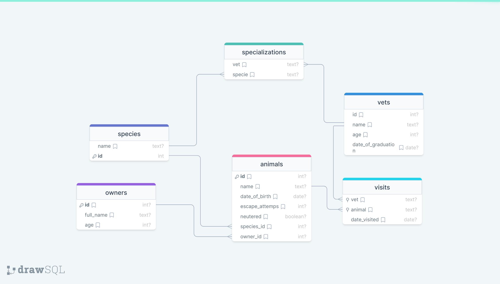

# Vet Clinic Database

## Description

In this project I created a database for a vetenarian's clinic, after which I created a table to store data for each animal.

## Database Schema Diagram

## Authors

👤 **Okoye Charles**

- GitHub: [@OkoyeCharles](https://github.com/OkoyeCharles)
- Twitter: [@OkoyeCharles_](https://twitter.com/OkoyeCharles_)
- LinkedIn: [Okoye Charles](https://www.linkedin.com/in/charles-k-okoye/)

## 🤝 Contributing

Contributions, issues, and feature requests are welcome!

Feel free to check the [issues page](https://github.com/OkoyeCharles/vet-clinic-database/issues).

## Show your support

Give a ⭐️ if you like this project!

## Acknowledgments

- Microverse's database template.
